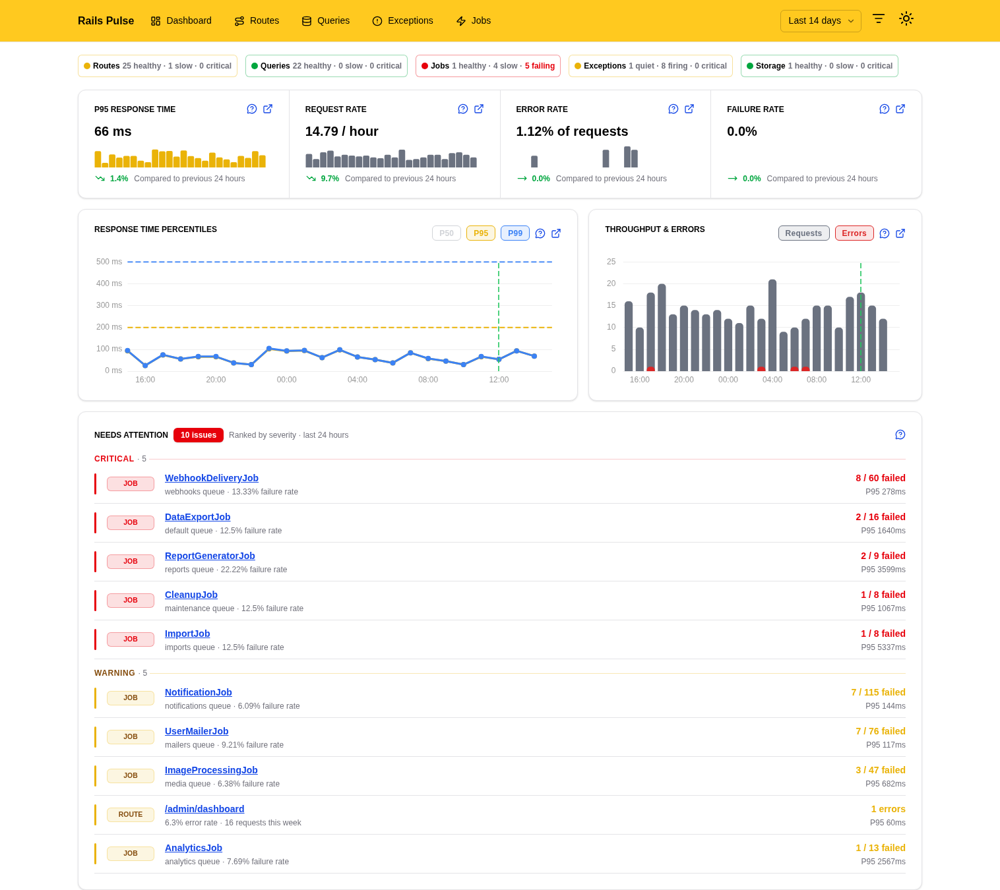
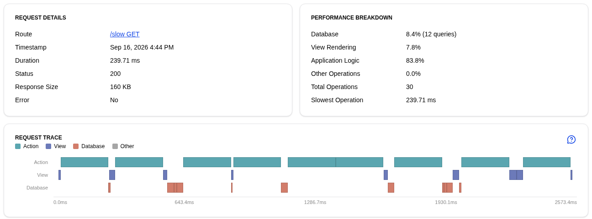
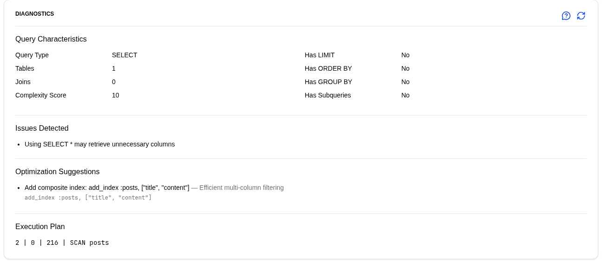
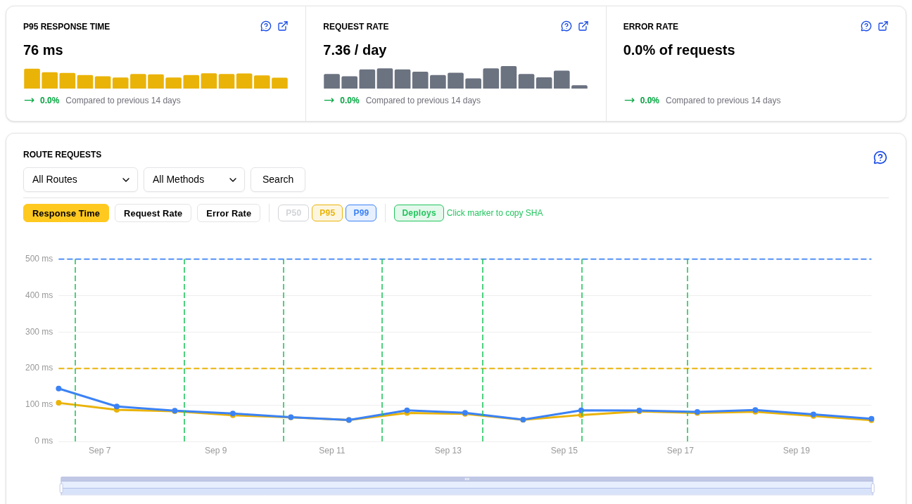

<div align="center">
  
</div>

# Rails Pulse

**Performance monitoring that lives inside your Rails app.** Slow requests, N+1 queries, background jobs and exceptions, stored in your own database. No agent, no account, no data leaving your servers.


Rails Pulse is a Rails engine. It hooks into the instrumentation Rails already emits, writes what it sees to a handful of tables, and mounts a dashboard that shows you where the time went. Install the gem, run one migration, schedule two jobs, and you have monitoring that works the same on SQLite, PostgreSQL and MySQL.


<picture>
  <source media="(prefers-color-scheme: dark)" srcset=".github/images/dashboard-dark.png">
  
</picture>

## What you get

- **The state of the app in one screen.** A health bar counts healthy, slow and critical routes, queries, jobs and exception groups. A ranked "needs attention" list tells you what to fix first.
- **Every request, broken down.** Each request stores its route, status, duration and a timeline of the SQL, view, cache, HTTP, mailer and Active Storage operations inside it.
- **Queries you can act on.** SQL is normalised and fingerprinted, so you see execution counts and P95 per statement shape, N+1 patterns, an EXPLAIN plan and index suggestions.
- **Jobs and exceptions in the same place.** Duration, queue wait and failure rate for every Active Job class on any adapter. Unhandled exceptions from requests and jobs grouped by class and location, with filtered params and backtraces.
- **Numbers over time.** Hourly, daily, weekly and monthly summaries with P50, P95 and P99, your service level objectives drawn as lines on the charts, and a marker for every deploy so a regression lines up with the release that caused it.
- **Built for production.** Tracking is queued off the request thread and dropped rather than blocked under load. If the gem is deployed before its migrations, tracking pauses and tells you what to run. Retention is enforced by age and by row count so the tables never grow without bound.

<table>
  <tr>
    <td width="50%" valign="top">
      <picture>
        <source media="(prefers-color-scheme: dark)" srcset=".github/images/request-dark.png">
        
      </picture>
      <p align="center"><sub>A request and where its time went</sub></p>
    </td>
    <td width="50%" valign="top">
      <picture>
        <source media="(prefers-color-scheme: dark)" srcset=".github/images/query-dark.png">
        
      </picture>
      <p align="center"><sub>Diagnostics and an index suggestion for one query</sub></p>
    </td>
  </tr>
  <tr>
    <td colspan="2">
      <picture>
        <source media="(prefers-color-scheme: dark)" srcset=".github/images/route-dark.png">
        
      </picture>
      <p align="center"><sub>One route over two weeks, with objective lines and deploy markers</sub></p>
    </td>
  </tr>
</table>

## Quick start

```ruby
# Gemfile
gem "rails_pulse"
```

```bash
bundle install
rails generate rails_pulse:install
rails db:migrate
```

```ruby
# config/routes.rb
mount RailsPulse::Engine => "/rails_pulse"
```

Schedule the summary job hourly and the cleanup job daily with whatever your queue adapter provides. With Solid Queue:

```yaml
# config/recurring.yml
production:
  rails_pulse_summary:
    class: RailsPulse::SummaryJob
    schedule: "5 * * * *"
  rails_pulse_cleanup:
    class: RailsPulse::CleanupJob
    schedule: "0 1 * * *"
```

Open `http://localhost:3000/rails_pulse`. That's the whole setup.

Requirements: Ruby 3.2+, Rails 7.2+ (tested on 7.2, 8.0 and 8.1), SQLite, PostgreSQL or MySQL.

Full install guide, including a separate database and plain cron: [railspulse.com/documentation/installation](https://railspulse.com/documentation/installation)

## Going further

**Lock it down.** The dashboard is authenticated by default outside development and test. Point it at your own auth with a predicate; anything but `true` is a 403.

```ruby
RailsPulse.configure do |config|
  config.authorize = ->(controller) { controller.current_user&.admin? }
end
```

With nothing configured it falls back to HTTP Basic against `RAILS_PULSE_USERNAME` and `RAILS_PULSE_PASSWORD`. [Authentication guide](https://railspulse.com/documentation/authentication)

**Tune it.** Thresholds for slow, very slow and critical, service level objectives per percentile, what to ignore, what to tag, how long to keep. All in `config/initializers/rails_pulse.rb`. [Configuration reference](https://railspulse.com/documentation/advanced)

**Run the dashboard on its own.** `bundle exec rails_pulse_server` serves the UI from a separate process with its own health endpoint, so a slow report never competes with your app for a thread. [Deployment modes](https://railspulse.com/documentation/deployment-modes)

**Mark your deploys.** `rails rails_pulse:record_deployment[sha]` from a release script, or `POST /rails_pulse/deployments` with a token from CI, and every chart draws a line at that moment.

**Keep it in its own database.** `rails generate rails_pulse:install --database=separate` puts the tables somewhere your primary never has to vacuum. [Database setup](https://railspulse.com/documentation/database)

## Upgrading

```bash
bundle update rails_pulse
rails generate rails_pulse:upgrade
rails db:migrate                  # separate Pulse database: rails db:migrate:rails_pulse
rails rails_pulse:status          # exits 1 while anything still needs action
```

Upgrading from 0.3.x to 0.4? **Back up first**, run `rails rails_pulse:migrate_routes` after migrating, and restart every process together. The details are in the [changelog](CHANGELOG.md).

## Contributing

Bug reports and pull requests are welcome on [GitHub](https://github.com/railspulse/rails_pulse). `docs/` explains how the pieces fit and why they are built the way they are.

```bash
git config core.hooksPath .githooks   # once, after cloning
DB=sqlite3 rake test                  # or DB=postgresql / DB=mysql2
bundle exec rubocop
```

## License

Available as open source under the [MIT License](https://opensource.org/licenses/MIT).
